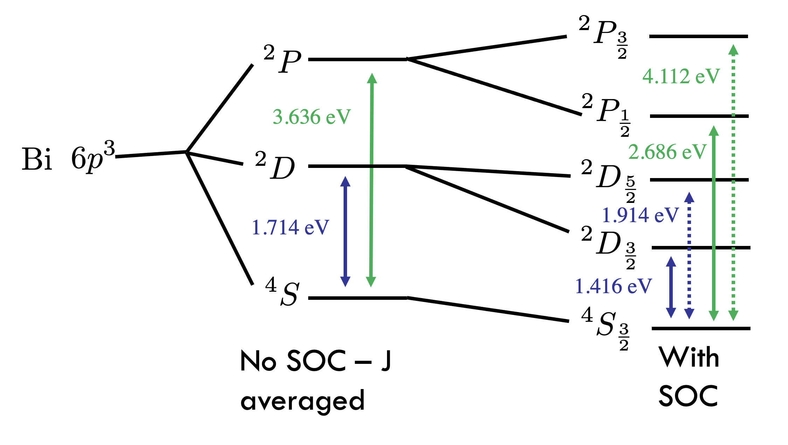
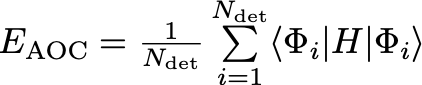
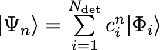

================================================
Bi ground state multiplet with DIRAC and QMCPACK
================================================

In this example, we give an example of using DIRAC to calculate 
spin-orbit splittings of the 6s\ :sup:`2`\ 6p\ :sup:`3` occupations of the Bi atom. 
We can find the experimental splittings from the `NIST Atomic Spectra Database <https://physics.nist.gov/cgi-bin/ASD/energy1.pl?de=0&spectrum=Bi+I&submit=Retrieve+Data&units=1&format=0&output=0&page_size=15&multiplet_ordered=0&average_out=1&conf_out=on&term_out=on&level_out=on&unc_out=1&j_out=on&lande_out=on&perc_out=on&biblio=on&temp=>`_

For the first few states on the NIST page, we notice there are a number of term symbols :sup:`2S+1`\ L\ :sub:`J` for the 6s\ :sup:`2`\ 6p\ :sup:`3` occupation. 
In the abscence of spin-orbit coupling, the various J states averaged to give just :sup:`4`\ S, :sup:`2`\ D, and :sup:`2`\ P, whereas with SOC we obtain the J states are split and we obtain the various splittings, illustrated below.

  
.. contents::

Example 1: Spin-orbit averaged states of Bi with DIRAC
======================================================

To set up a DIRAC calculation, there are two input files needs, the ``*.inp`` file which specifies the type of calculation to be done, and the ``*.mol`` file which
specifies the geomerty, basis sets, effective core potentials (ECPs), etc.

For a thorough decription of DIRAC input/out see `DIRAC <http://www.diracprogram.org/doc/release-21/>`_

*.mol file
----------
Here we will breakdown the *.mol file step by step. A detailed desrciption of the *.mol file can be found `here <http://www.diracprogram.org/doc/release-21/molecule_and_basis/molecule_using_mol.html>`_   
:: 
  INTGRL 
  Bi        
  Bi STU ecp
  C   1         
        83.    1 
  Bi     0.000000           0.00000000        0.00000000
  
Here, the first ``INTGRL`` is required, and the next two lines are simply comments. 
The ``C   1`` specifies that we want cartesian spherical basis sets and only 1 atom.
After that, for each diffent species we list the atomic number and how many of that element we want. 
In this case, we are keeping things simple and only doing an atom at the origin.
::
  LARGE EXPLICIT  4    1    1    1    1            
  f  13  0                 
  798.633           
  95.0023 
  21.2520
  13.2919 
  8.31210
  5.19476
  1.90972
  0.962271
  0.356026
  0.168327
  0.0784  
  0.073265
  0.0297
  f  12  0
  19.2259
  12.0378
  7.53621   
  2.16084
  1.13036       
  0.566778        
  0.4469            
  0.271608
  0.117769              
  0.0743                
  0.049304
  0.0276               
  f  9  0              
  65.0224               
  13.6908               
  7.09591
  2.52090              
  1.34066              
  0.682558
  0.327714              
  0.1306                
  0.0488
  f  2  0                                         
  0.3164
  0.1188

Under each atomic species type, we have to provide a basis set. The ``LARGE EXPLICIT  4    1    1    1    1`` tells us that we are specifying the basis for the large components of the spinors (note that for ECP calculations, we only have the large components. In all-electron calculations, DIRAC can automatically generate an eve-tempered basis for the small components based on the basis provided for the large components. So it is often sufficient to proivide only a LARGE basis. The ``EXPLICIT`` simply means that we are explicitly typing a basis. The ``4`` tells us that we will have 4 different angular momentum basis sets ``s,p,d,f`` in this case. The subsequent ``1`` means that we are writing one set of exponents and coefficients for each shell. 

For each individual angular momentum basis, the expansion starts as ``f   N  0`` and tells us the number of exponents to read, and the 0 means that we will be using an uncontracted basis. For an uncontracted basis, we do not need the coefficients. These can be provided as additional columns if desired (see the link above). 

Lastly, for each atomic species we need to provide an ECP specification. A detailed description of the input can be found `here <http://www.diracprogram.org/doc/release-21/molecule_and_basis/molecule_with_ecp.html>`_ 
::
  ECP 78 5 0
  3
  1 40.00000 5.0
  3 38.50000 200.0
  2 40.00000 -74.796
  2
  2  1.994153  35.755622
  2  0.240286  -0.404113
  4
  2  0.896039  2.688441
  2  0.875463  5.715603
  2  0.262580  -0.171255
  2  0.232846  -0.150845
  2
  2  0.779775  4.060445
  2  0.739216  5.980282
  2
  2  0.987519  -2.646547 
  2  0.959907  -3.373825
  FINISH
 
Here ``ECP 78 5 0`` indicates that this ECP removes 78 core electrons, and have 5 channels (1 local and 4 nonlocal) and 0 spin-orbit channels. For spin-averaged calculations, we do not include the spin-orbit terms (we will add them later). You provide the local channel first, then each subsequent channel in order of increasing angular momentum (i.e. local, s, p, d, f in this case). For each channel, we specify the number of radial gaussian and then the gaussian parameters (n, a, c) where the gaussian is of the form c*r\ :sup:`n-2`\ *exp(-a*r\ :sup:`2`\ ). 
Lastly, after specifying all the basis sets and ECPs for the various atoms, we must conclude the file with ``FINISH``.

For this example, I am using a Stuttgart ECP (can be found `here <http://www.tc.uni-koeln.de/PP/clickpse.en.html>`_) and the corresponding basis set (uncontracted). Note that for Stuttgart ECPs, the potentials are divergent. I have modified the local channel myself to *smooth* the potential which helps with the efficiency of the subsesquent QMC. I will not be covering how to smooth a potential without changing  its propertiess. If you need help with potential, reach out to the QMCPACK developers.

*.inp file
----------

Here I will outline some of the critical parameters for the *.inp file to perform a complete open-shell confiuration interaction (COSCI). To understand the different input options, it is best to read through the various tutorials on the DIRAC page. 
::
  **DIRAC
  .WAVE FUNCTION
  .ANALYZE
  **HAMILTONIAN
  .ECP
  **INTEGRALS
  *READIN
  .UNCONTRACT
  
This indicates that we want to use the ``WAVE FUNCTION`` and ``ANALYZE`` modules which allows us to calculate wave functions and perform some analysis on the states and spinors. 
We specify that we are using ECPs in the ``HAMILTONIAN``. Additionally, I also specify that I want to use uncontracted basis sets (this will override whatever is specified in the *.mol file. In this case, this keyword is redundant since I already specified an uncontracted basis in the *.mol file). 

The actual calculation is specified by the ``**WAVE FUNCTION`` module
::
  **WAVE FUNCTION
  .SCF
  .RESOLVE
  *SCF
  .CLOSED SHELL
  2 0
  .OPEN SHELL
  1
  3/0,6
  .EVCCNV
  1.0d-05
  
We specifiy that we want to do an SCF calulation, which will perform an *average of configurations* SCF calculation. 

  
which will set up all the possible determinants for the open-shell occupations specified (more on this later). The SCF procedure finds the spinors which minimizes this energy. The individiual states can be obtained by the ``.RESOLVE`` keyword, which diagonalizes the states in the determinant basis, which will result in small CI expansions for the various states.

  
In the ``*SCF`` section, we need to actually specify the occupations we are desired in studying. As mentioned above, for Bi we have the 6s\ :sup:`2`\ 6p\ :sup:`3` occupation. In DIRAC, we have to specify the occupations by the symmetry of the spinors (gerade/even or ungerade/odd). Note that s,d,g, etc are all gerade and p,f,h, etc are all ungerade symmetry. We want to specify the 6s\ :sup:`2` as closed, so we will have 2 electrons closed in the gerade channel and 0 closed in the ungerade channel, hence
::
  .CLOSED
  2 0
  
For the open shells, we have 3 electrons in the p states. We note that there are 6 total occupations for the p states (in the non-spin-orbit case we have p\ :sub:`x`\  , p\ :sub:`y`\ , p\ :sub:`z` each with up and down options. For a spin-orbit case, this would be the j=1/2 (degeneray 2) and j=3/2 (degeneracy 4). Both end up wth 6 total possible states). We want to fix the electrons to be p electrons only, and we do not want to distribute these electrons into any gerade spinors. 
Therefore, we specify
::
  .OPEN SHELL
  1
  3/0,6
  
We only have one active space in this case, however we could increase this and add multiple occupation lines. Additinoally, we could do a larger scale COSCI calculation where we correlate the s electrons as well with the following input
::
  .CLOSED
  0 0
  .OPEN SHELL
  1
  5/2,6
  
For simplicity, we will work with the first input. 

Note that since we have 6 possible spinors for the p elecrons, and we only occupy with 3 electrons, we will have 6choose3 = 20 possible determinants/COSCI states after calling ``.RESOLVE``

Lastly, an important part of the input is the ``**ANALYZE`` module, where we specify some additional printing to the output file. Some of this is **required** for conversion to QMCPACK.
::
  **ANALYZE
  .PRIVEC
  .MULPOP
  *PRIVEC
  .AOLAB
  .VECPRI
  1..oo
  1..oo
  .PRINT
  1
  *MULPOP
  .AOLAB
  .VECPOP
  1..oo
  1..oo
  .PRINT
  1
  
The ``.PRIVEC`` specifies that we want to print the obtained spinors. **THIS IS REQUIRED FOR CONVERSION TO QMCPACK**, otherwise we cannot read the spinor coefficients. In the ``*PRIVEC``, we indiccate that we want to print the spinors (eigenvectors) in the atomic orbital basis (hence, the ``.AOLAB``). The ``.VECPRI`` tells us to print to the output file all of the spinors for each symmetry (gerade, then ungerade). The ``1..oo`` prints all the spinors in that symmetry channel. If we only want to print the first 10 for example, we could just write ``1..10``. The ``.MULPOP`` command is not required, but it is useful to see the mulliken population analysis of the spinors. 

Running DIRAC and understanding the output
------------------------------------------

Running DIRAC is straightforward. Assuming the ``pam-dirac`` script is in your path, you can simply run 
::
  pam-dirac --inp="cosci.inp" --mol="Bi.mol"

Assuming this is successful, we will be able to see the output in the ``cosci_Bi.out`` file.

To see the results of the average of configurations calculations, we can look for the total energy
::
                                   TOTAL ENERGY
                                   ------------

   Electronic energy                        :    -5.2141207112141519

   Other contributions to the total energy
   Nuclear repulsion energy                 :     0.0000000000000000

   Sum of all contributions to the energy
   Total energy                             :    -5.2141207112141519

The energy of *E* = -5.21412 Ha, this is the energy obtained from the E\ :sub:`AOC` expression above.

In order to connvert to QMCPACK, we need to make sure the eigenvectors (spinors) were actually printed. 
::
    **************************************************************************
    ****************************** Vector print ******************************
    **************************************************************************

    Coefficients from DFCOEF
    ------------------------

                                Fermion ircop E1g
                                -----------------

  * Electronic eigenvalue no.  1: -0.6809061437841
  ====================================================
       1  L Bi  1 s             0.0000118634        0.0000000000        0.0000000000        0.0000000000
       2  L Bi  1 s            -0.0002764816        0.0000000000        0.0000000000        0.0000000000
       3  L Bi  1 s             0.0078341692        0.0000000000        0.0000000000        0.0000000000
       4  L Bi  1 s            -0.0357656369        0.0000000000        0.0000000000        0.0000000000
       5  L Bi  1 s             0.0729896399        0.0000000000        0.0000000000        0.0000000000
       6  L Bi  1 s            -0.0698826077        0.0000000000        0.0000000000        0.0000000000
       ...
       
The columns correspond to the real and imaginary parts of the up and down components of the total spinor. The qmcpack converter understands how to handle this. 

Next we want to check if the open-shell states are resolved into the various small CI expansions (COSCI calculation)
::
    *************************************************************************
    ******************** Resolution of open-shell states ********************
    *************************************************************************
      
Assuming we find this, we can search for the results. 
::
 Energy eigenvalues in atomic units

 Level   Rel eigenvalue     Abs eigenvalue      Total Energy    Degeneracy

    1     0.0000000000     -1.750400036742       -5.271133025983 (   4 * )
    2     0.0570123148     -1.693387721973       -5.214120711214 (  10 * )
    3     0.0950205246     -1.655379512127       -5.176112501368 (   6 * )

First thing to note, the individually resolved energies all average to the SCF energy we found above, i.e.  ``(1/20  * (4 * -5.271133 + 10 * -5.214120 + 6 * -5.176112)) = -5.214120 Ha``. Next we can identify the states as the states shown in the first image. From the experimental spetrum, we only have the :sup:`4`\ S\ :sub:`3/2` state which *isn't* j-averaged, so the degeneracy of this state is 4. Note there are both :sup:`2`\ D\ :sub:`3/2` and :sup`2`\ D\ :sub:`5/2` states which get averaged in the absence of spin-orbit, so there are 4+6=10 total degenerate states. Lastly, the :sup:`2`\ P\ :sub:`3/2` and :sup:`2`\ P\ :sub:`1/2` states, which get averaged in the absence of spin-orbit, so there are 4+2 = 6 total states. Therefore, we have reproduced the ordering of the j-averaged experimental spectrum when we neglect SOC. We also note the splittings of 0.057012 Ha and 0.095020 Ha correspond to 1.55137 eV and 2.585625 eV respetively. Compared to the experimental j-averaged spectrum, we have errors of roughly 0.163 eV and 1.050 eV respectively. 

This simple COSCI treatment can be signifiantly improved with QMC for the j-averaged states. However, we will now focus on the SOC calculations and perform QMC calcualtions on the SOC calculations. 

Example 2: Spin-Orbit split states of Bi with DIRAC
===================================================
In this example, we now include SOC and will perform the necessary QMC calculations to resolve some of the excited states. 

SCF calculation
---------------
Conviently, the only necessary change to include spin-orbit is to include the actual spin-orbit terms in the ECP. 
::
  ECP 78 5 3
  3
  1 40.00000 5.0
  3 38.50000 200.0
  2 40.00000 -74.796
  2
  2  1.994153  35.755622
  2  0.240286  -0.404113
  4
  2  0.896039  2.688441
  2  0.875463  5.715603
  2  0.262580  -0.171255
  2  0.232846  -0.150845
  2
  2  0.779775  4.060445
  2  0.739216  5.980282 
  2
  2  0.987519  -2.646547
  2  0.959907  -3.373825
  4                       
  2  0.896039  -5.376883
  2  0.875463  5.715603
  2  0.262580  0.342510
  2  0.232846  -0.150845
  2
  2  0.779775  -4.060445
  2  0.739216  3.986855
  2
  2  0.987519  1.764365
  2  0.959907  -1.686912
  FINISH

In the ``ECP`` line, the last number corresponds to the number of spin-orbit angular momentum channels, starting from l=1 or p. This is because spin-orbit doesn't apply to s states, (note SOC goes as l.s, and for l=0 states the contribution is zero). So in this case, we have 3 SOC channels for p, d, and f. 

Similar to the spin-averaged case, we can look for the energy from the average-of-configurations calculation. 
::
                                   TOTAL ENERGY
                                   ------------

   Electronic energy                        :    -5.2221643043234707

   Other contributions to the total energy
   Nuclear repulsion energy                 :     0.0000000000000000

   Sum of all contributions to the energy
   Total energy                             :    -5.2221643043234707
   
Notice that the total energy is different than the spin-averaged...the new spin-orbit contribution to the Hamiltonian lowers the energy. We can now look at the COSCI states
::
    1     0.0000000000     -1.780162163308       -5.300947773703 (   4 * )
    2     0.0566920241     -1.723470139197       -5.244255749591 (   4 * )
    3     0.0782419737     -1.701920189567       -5.222705799962 (   6 * )
    4     0.1142162781     -1.665945885253       -5.186731495648 (   2 * )
    5     0.1627542231     -1.617407940163       -5.138193550557 (   4 * )
    
Note that the total energies of the invidual states average to give the average of configurations energy, e.g. ``1/20*(4*(-5.3009) + 4(*-5.2442) + 6*(-5.2227) + 2*(-5.1867) + 4*(-5.1381)) = -5.22216 Ha``. Also, now the states are in the same order as the experimental spectrum show at the top of this page, namely :sup:`4`\ S\ :sub:`3/2` is the ground state, followed by :sup:`2`\ D\ :sub:`3/2`\ , :sup:`2`\ D\ :sub:`5/2`\ , :sup:`2`\ P\ :sub:`1/2`\ , :sup:`2`\ P\ :sub:`3/2`.

At the COSCI level of theory, the energy differences come out to 1.54266, 2.12904, 3.1079, and 4.428761 eV, which corresponds to roughly  -0.1266, -0.2150, -0.4219 and -0.31676 eV respectively. Now, lets see if we can improve the agreement with experiment by using the COSCI wave functions as trial wave functions in QMCPACK

Conversion to QMCPCACK using convert4qmc
----------------------------------------

Here we are going to discuss converting the DIRAC output into a QMCPACK hdf5 format and xml input files. Note that to run with spin-orbit, the pseudopotential file must include spin-orbit terms. In order to obtain a QMCPACK pesudopotential file with SOC terms, please contact the developers. 

To generate the hdf5 and QMCPACK input files, this can be accomplished using the ``convert4qmc`` executable. Running ``convert4qmc`` without any arguments provides the options for the code. 
::
  |-> convert4qmc
  Rank =    0  Free Memory = 78555 MB
  Usage: convert [-gaussian|-gamess|-orbitals|-dirac|-rmg] filename 
  [-nojastrow -hdf5 -prefix title -addCusp -production -NbImages NimageX NimageY NimageZ]
  [-psi_tag psi0 -ion_tag ion0 -gridtype log|log0|linear -first ri -last rf]
  [-size npts -multidet multidet.h5 -ci file.out -threshold cimin -TargetState state_number -NaturalOrbitals NumToRead -optDetCoeffs]
  Defaults : -gridtype log -first 1e-6 -last 100 -size 1001 -ci required -threshold 0.01 -TargetState 0 -prefix sample
  When the input format is missing, the  extension of filename is used to determine the format 
  *.Fchk -> gaussian; *.out -> gamess; *.h5 -> HDF5

All we need to do is run the converter on the DIRAC output file and it will generate the hdf5 file and corresponding QMCPACK xml inputs. If the converter detects only an SCF calculation (DFT or just average-of-configurations HF) it will generate a single determinant wave function. If the converter detects a COSCI calculation, it will generate the corresponding CI wave function for the targeted state. For example:
::
  |-> convert4qmc -dirac cosci_Bi.out
  Rank =    0  Free Memory = 78550 MB                                     
  Index of ion charge 0                             
  Index of valence charge 1    
  Using cosci_Bi to name output files
  Found 1 unique species              
  Found 1 total number of atoms      
                              
  Reading spinor info          
  ========================================================================
  Found 2 fermion irreps.      
    irrep E1g with 58 spinors and 123 AO coefficients.
    irrep E1u with 50 spinors and 123 AO coefficients.
  Found coefficients for E1g        
  Generated kramers pair with irrep E2g
  Found coefficients for E1u    
  Generated kramers pair with irrep E2u
  Now we have the following spinors     
    irrep E1g with 58 spinors and 123 AO coefficients.
    irrep E2g with 58 spinors and 123 AO coefficients.
    irrep E1u with 50 spinors and 123 AO coefficients.
    irrep E2u with 50 spinors and 123 AO coefficients.
                                  
  Parsing wave function info    
  ========================================================================
  Found Complete Open-Shell CI (COSCI) wave function
                              
  Orbital Info                  
  ------------------------------------
  irrep: E1g                         
    closed  : 1                 
    active  : 0                          
    virtual : 57                                                                                                                                                  
    total   : 58               
  irrep: E1u                   
    closed  : 0                
    active  : 3                     
    virtual : 47                                                    
    total   : 50                          
                                                                                                                                                                
  Sorting spinors into DIRAC COSCI order  
  
  COSCI State Info
  ------------------------------------
  Found 6 representations
  Representation: 1u with 5 states
    state#     Energies and Ndets:
      0 -5.300947770000e+00 5
      1 -5.244255750000e+00 4
      2 -5.222705800000e+00 3
      3 -5.186731500000e+00 2
      4 -5.138193550000e+00 5
  Representation: -1u with 5 states
    state#     Energies and Ndets:
      5 -5.300947770000e+00 5
      6 -5.244255750000e+00 4
      7 -5.222705800000e+00 3
      8 -5.186731500000e+00 2
      9 -5.138193550000e+00 5
  Representation: 3u with 4 states
    state#     Energies and Ndets:
      10 -5.300947770000e+00 4
      11 -5.244255750000e+00 3
      12 -5.222705800000e+00 2
      13 -5.138193550000e+00 4
  Representation: -3u with 4 states
    state#     Energies and Ndets:
      14 -5.300947770000e+00 4
      15 -5.244255750000e+00 3
      16 -5.222705800000e+00 2
      17 -5.138193550000e+00 4
  Representation: 5u with 1 states
    state#     Energies and Ndets:
      18 -5.222705800000e+00 1
  Representation: -5u with 1 states
    state#     Energies and Ndets:
      19 -5.222705800000e+00 1
  Saving wave function for target state 0
  note: if you want another state run with -TargetState #_of_desired_state shown above                                                                                 

  QMCGaussianParserBase::dump
  Adding Two-Body and One-Body jastrows with rcut="10" and size="10"
  Adding Three-Body jastrows with rcut="5"
  Generating Standard Input file containing VMC, standard optmization, and DMC blocks.                        
  Modify according to the accuracy you would like to achieve.
  Hamiltonian using ECP for Electron Ion=1
                                        

This will create a wave function for the first state it encounters. Notice DIRAC has CI expansions for all 20 states and the degeneraciess described in the previous section. We can select whichever state we want to calculate with the ``--TargetState #`` flag. 

First we will check that the converter worked correctly, and try to reproduce the COSCI energies in QMCPACK. To do this, we will simply calculate the VMC energy ofthe various wavefunctions, with no jastrow. If we look at the 5 states in *Representation 1u*, we see the 5 distinct energies found from the COSCI calculation. 

I will generate different inputs for these states, and run qmcpack on the generated files as 
::
  |-> convert4qmc -dirac cosci_dirac.out -nojastrow -TargetState 0 -prefix state_0
  |-> mpirun -np N qmcpack-complex state_0.qmc.in-wfnoj.xml | tee state_0.qmc.in-wfnoj.out

  |-> convert4qmc -dirac cosci_dirac.out -nojastrow -TargetState 1 -prefix state_1
  |-> mpirun -np N qmcpack-complex state_1.qmc.in-wfnoj.xml | tee state_1.qmc.in-wfnoj.out

  |-> convert4qmc -dirac cosci_dirac.out -nojastrow -TargetState 2 -prefix state_2
  |-> mpirun -np N qmcpack-complex state_2.qmc.in-wfnoj.xml | tee state_2.qmc.in-wfnoj.out

  |-> convert4qmc -dirac cosci_dirac.out -nojastrow -TargetState 3 -prefix state_3
  |-> mpirun -np N qmcpack-complex state_3.qmc.in-wfnoj.xml | tee state_3.qmc.in-wfnoj.out

  |-> convert4qmc -dirac cosci_dirac.out -nojastrow -TargetState 4 -prefix state_4
  |-> mpirun -np N qmcpack-complex state_4.qmc.in-wfnoj.xml | tee state_4.qmc.in-wfnoj.out
  
After running the no-jastrow VMC for each of these, we should find something similar to the energies here:
::
  |-> qmca -q ev state*.s000.scalar.dat
  state_0  series 0  -5.298979 +/- 0.003575   0.258737 +/- 0.013551   0.0488 
  state_1  series 0  -5.240950 +/- 0.005215   0.360711 +/- 0.083699   0.0688 
  state_2  series 0  -5.221590 +/- 0.002897   0.290984 +/- 0.021331   0.0557 
  state_3  series 0  -5.188029 +/- 0.003165   0.282325 +/- 0.010537   0.0544 
  state_4  series 0  -5.139926 +/- 0.002713   0.281456 +/- 0.013977   0.0548

While these are relatively short calculations, we obtain the same energies (within statistical errorbars) to the underlying COCSI calcultions. To see how QMC can improve these, we can use ``convert4qmc`` to generate new input files that include jastrow optimization and VMC/DMC calculations. For each state, we do
::
  |-> convert4qmc -dirac cosci_dirac.out -TargetState 0 -prefix state_0
  |-> mpirun -np N qmcpack-complex state_0.qmc.in-wfj.xml | tee state_0.qmc.in-wfj.out

  |-> convert4qmc -dirac cosci_dirac.out -TargetState 1 -prefix state_1
  |-> mpirun -np N qmcpack-complex state_1.qmc.in-wfj.xml | tee state_1.qmc.in-wfj.out

  |-> convert4qmc -dirac cosci_dirac.out -TargetState 2 -prefix state_2
  |-> mpirun -np N qmcpack-complex state_2.qmc.in-wfj.xml | tee state_2.qmc.in-wfj.out

  |-> convert4qmc -dirac cosci_dirac.out -TargetState 3 -prefix state_3
  |-> mpirun -np N qmcpack-complex state_3.qmc.in-wfj.xml | tee state_3.qmc.in-wfj.out

  |-> convert4qmc -dirac cosci_dirac.out -TargetState 4 -prefix state_4
  |-> mpirun -np N qmcpack-complex state_4.qmc.in-wfj.xml | tee state_4.qmc.in-wfj.out
  
